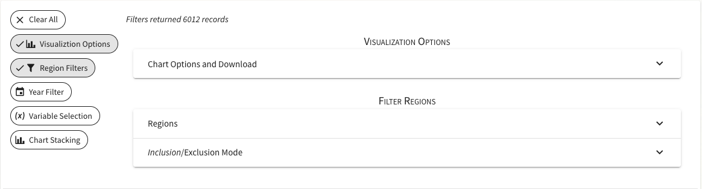
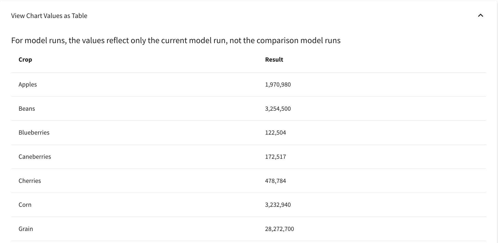
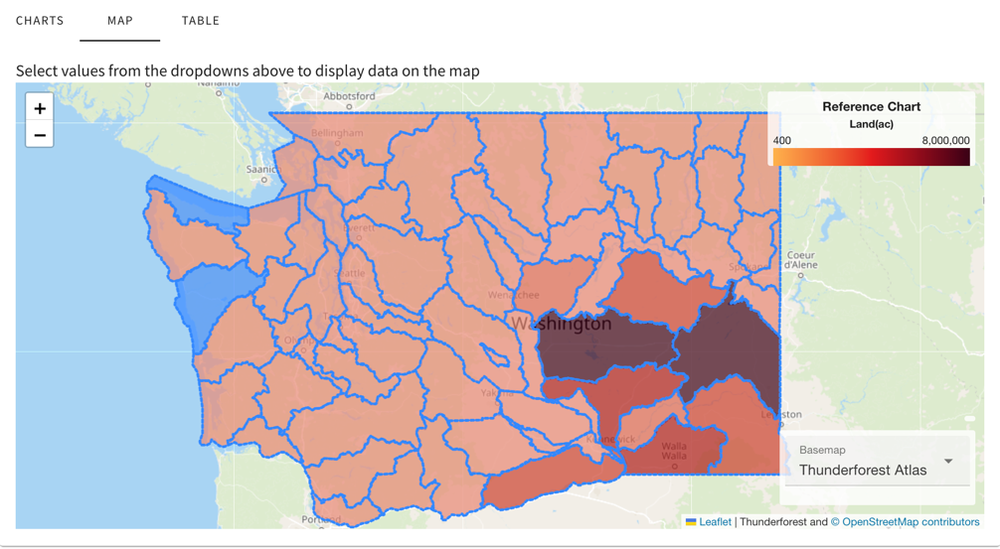
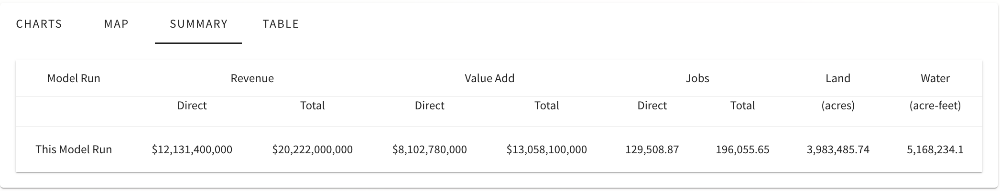
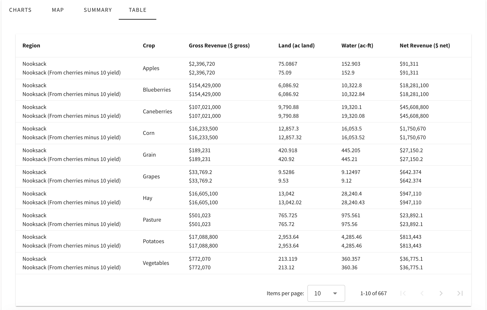

.. index::
    single: model run; view; results
    single: model run; results
    single: results

.. _ViewingModelRunResultsDoc:

Viewing Model Run Results and Raw Model Input Data
======================================================

Base Case
---------------

.. index::
    single: model run; data viewer;
    single: model run; data viewer; filters
    single: model run; results; filters

.. _DataViewerFiltersSection:

Filters
------------------

When viewing model data, either as model input data or in the results section of a model run page, the
application includes many filters and options for how the data are displayed. In order to keep the most
relevant information readily available, the application shows two row of filters and tools
at a time and you may show or hide additional filters using the menu at the left. When all filters
fit on one row, the menu on the left will not show and all filters are displayed automatically.

General Features
___________________

Crop Filtering
___________________

Drop down menu of sorted crops that are found in the model. Clicking on a crop will display the relevant information
on any tab of the data viewer. When viewing the Map, if the crop does not appear in the region then it will be shaded
as blue.

Region Filtering
___________________

Similar to Crop Filtering, but with the added option of toggling on **Inclusion/Exclusion Mode** (Inclusion is on by default).
Inclusion allows you to see the results (revenue, land, and water) given a selected region. Exclusion will remove a selected region's results
from the total, whether it be on Charts, Map, or Table. Region Filtering can be used with Crop Filtering to see the impacts of regions.

Irrigated and Nonirrigated Land Filtering
______________________________________________
Toggle between showing irrigated or nonirrigated crops.

Charts
--------------
Display results for either **Land, Water,** or **Revenue** in a Bar Chart. X-axis will consist of all the available crops
while the Y-axis depends on the selected variable. Additionally, you can toggle on Stack Chart.

It is also possible to compare between other scenarios if they are available. By default, the scenario you are viewing
will be set to orange and a selected run will be blue.

Chart Controls and Options
_________________________________

.. _visualization_def:

*Visualization Options*
   * **Add/Change Comparison Model Runs ( Empty )**: Drop down menu listing model runs created by yourself and your organization

   * **Change Baseline/Normalization ( Empty )**: Shows the difference between the viewing model run and another run. Additional option of turning on percentages to show the percent difference between the runs.

   * **Chart Options and Download**: Add a title to the chart that will be shown when downloading the chart as an image. You can also change the of the run that is shown when comparing to another run.

*Region Filters*
    * **Regions**: Drop down menu of regions found for the model area sorted alphabetically.
    * **Region Groups**: Groups of regions that is associated to counties in some model areas.
    * **Inclusion/Exclusion Mode ( Inclusion )**: When a region is selected, *Inclusion* will show the results of the region(s). *Exclusion* will remove the result for the region(s) and return the results without the region.

.. _variable_sel_def:

*Variable Selection*
    * **Map Variable**: Drop down menu to choose between which value (revenue, land, water) to display.

*Chart Stacking*
    * **Stack Bars by Crop ( Off )**: Change the bar graph to stack chart. This can not be toggled on with Change Baseline/Normalization as it will lead to incorrect values.

Tabular Display of Chart/Per-Crop Data
++++++++++++++++++++++++++++++++++++++++++++

Table view of the chart breaking down each crop and their value depending on the variable selected. This is found under
the bar chart.

Map View
------------------------

Another way to view the model run is with the `choropleth map <https://en.wikipedia.org/wiki/Choropleth_map#:~:text=Choropleth%20maps%20provide,other%20software%20tools>`_.
Most of the controls carry over but with the addition of *Normalize Map Values* and *Irrigated Data*. Depending on a region's color and
variable selected, the map and shading will change. For example, if a region's value is closer to the higher end of the limit it will
have a darker shade than the others while a value closer to the minimum will be lighter. Each variable will have a different color.

    * Land - Red
    * Water - Blue
    * Revenue - Green

* See :any:`visualization_def`

* See :any:`variable_sel_def`

* *Normalize Map Values*: Finds the proportion of a value corresponding to the region's land. This filter can be helpful
when using it with a crop filter. Note, if Map Variable Selection is set to Land it will only display 1 for all regions.

* *Irrigated Data*: Choose to display non-irrigated, irrigated, or both types of crops.

* *Basemap Controls*:
    .. figure:: ./basemap_controls_2025.gif

.. _SummaryResultsSection:

Summary View
-------------------

This tab only appears when viewing a model run and will not be shown on the homepage.

Table View
-----------------

Similar to the table found in the Chart tab, except this shows all crops found in each region. When using the
compare function, a new line will be added to each row with corresponding region from the compare model run.
If *Toggle Difference* is enabled, a tooltip will appear next to the values from the imported run explaining if
the value is greater or less than the viewing model run.

.. contents::
    :local: