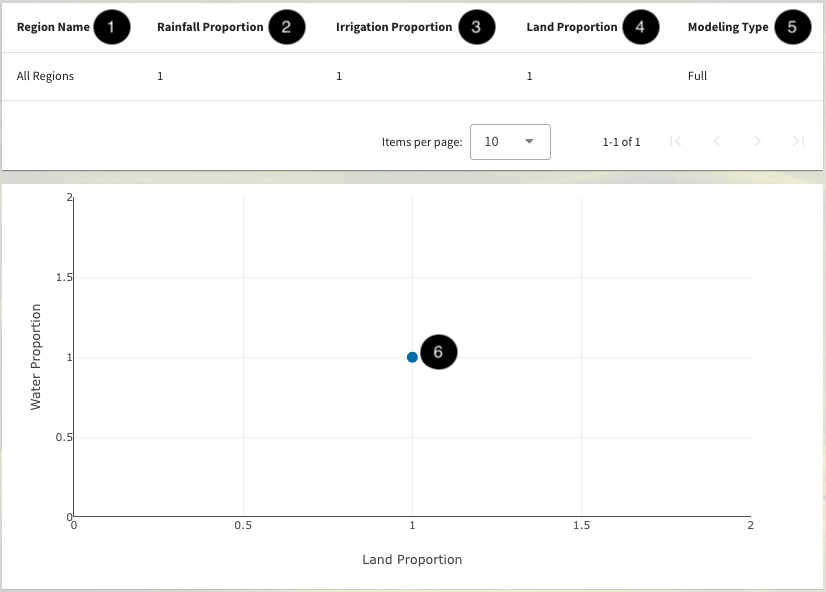

.. index::
    single: model run; view; inputs

.. _ViewingModelRunInputsDoc:

-------------------------
Viewing Model Run Inputs
-------------------------

After creating and heading onto a model run, you can see a breakdown of the regions, crops, and proportions that were modified.
Region and crop modifications are separated as they have different characteristics. You can hover over each dot to see the item name, proportion, and yield.

Region Modifications
=====================

    Table of Region Modifications for the base case.

- 1. Name of the region modified or if no modification were made it will input a default point of "All Regions"
- 2-4. These proportion values show the multiplier each region will have.
- 5. Modeling type shows how the regions will be scaled (See more on :ref:`Simple Model Formulation`)

The Crop Modifications section follows a similar format but will have sections for Min and Max Land Area Proportions.
All of these modifications can be changed when making a model run.

.. contents::
    :local:
