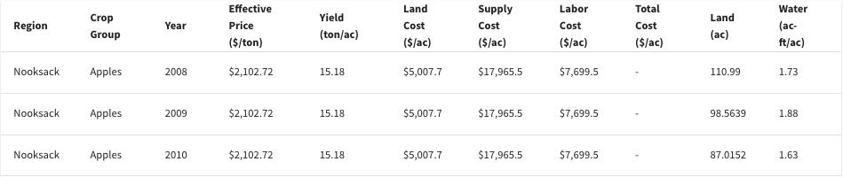
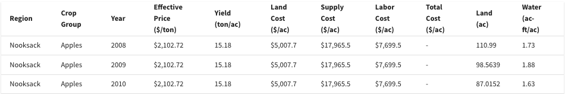
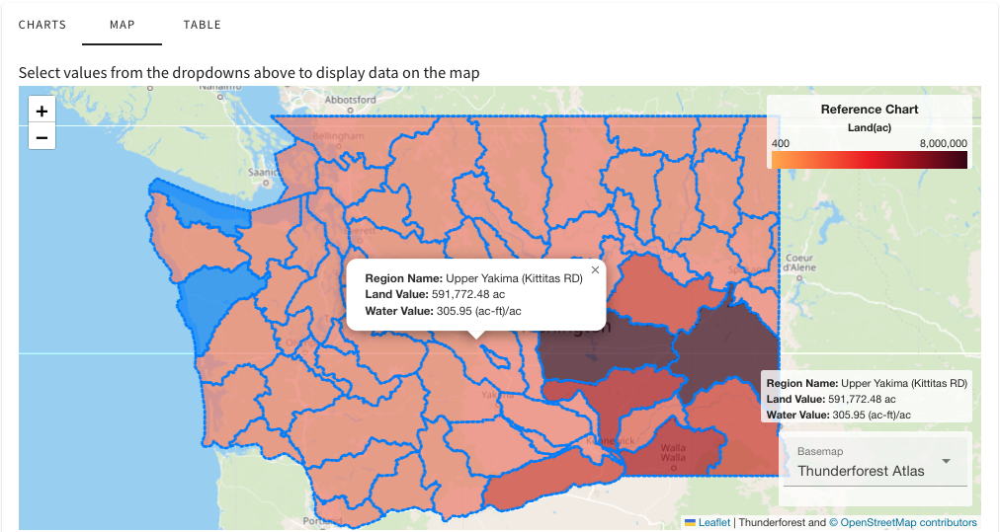

.. index::
    single: settings
    single: application settings

.. _SettingsDoc:

----------
Settings
----------

*Reduce spacing in tables ( Off )*
===================================

When enabled, it will give tables a more compact view by removing spacing inside the rows.

    Table spacing off

    Table spacing on

*Show model runs created by anyone in my organization ( On )*
==============================================================
Populates the Model Runs page with runs from members in your
organization. Turning this option off will only show the base case and runs created by you.

*Map popup ( Off )*
====================

When hovering over a map region a textbox will appear with the region's values and name. If regions are too close to
one another, it maybe have errors showing the textbox.